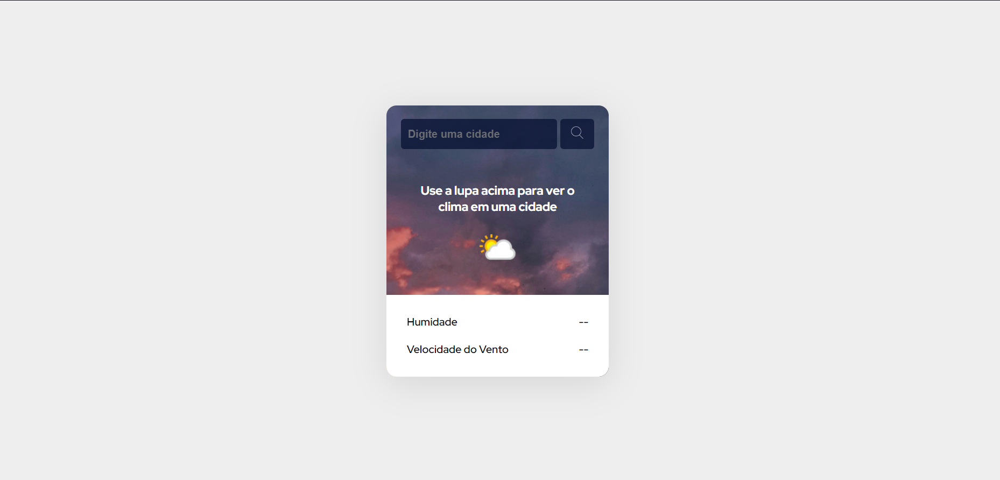

Projeito App previsão do tempo

Projeto realizado por William, pelas dicas e segmentos do Dev em Dobro. Conheça o site e estude esse projeto em formato de vídeo clicando aqui. Tecnologias | Projeto | Layout | Licença

🚀Tecnologias

Esse projeto foi desenvolvido com as seguintes tecnologias:

HTML e CSS
JavaScript
Git e Github
API

O Previsão do tempo projeto é um design de site para entrada e escolha de personagens, como se fosse um prologo de alguma batalha ou inicio de aventura de gameplay, nele você pode alterar os personagens e ler sua história e habilidades. 🔖 Layout

Você pode visualizar o layout do projeto Original através deste link:

  

Feito por William Ramos.